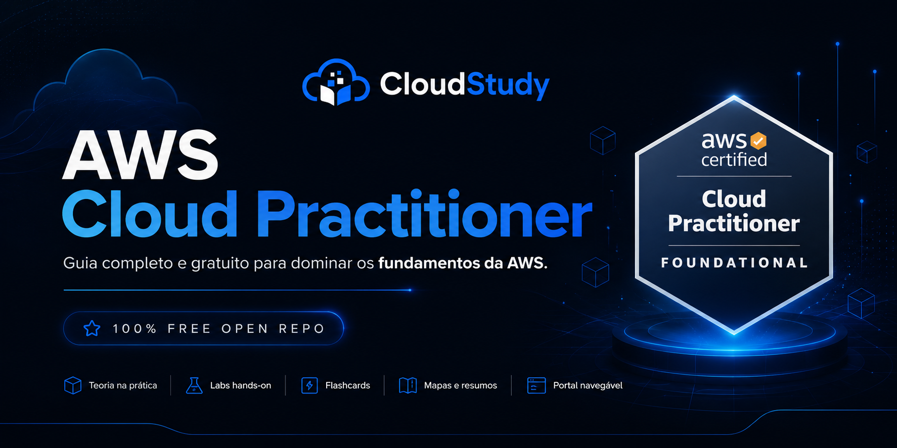
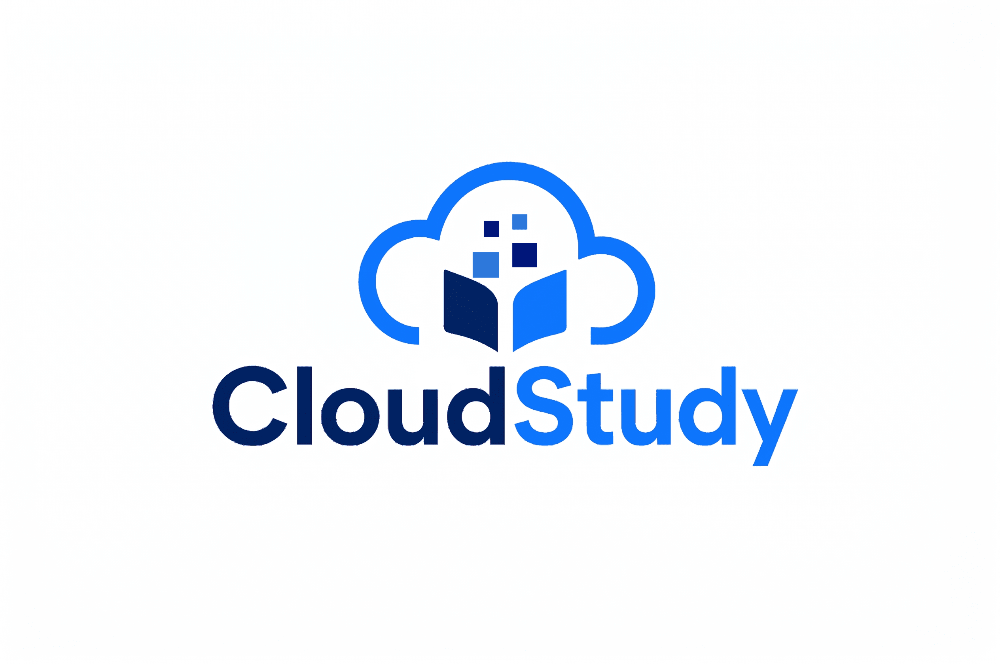

  

  

  <strong>Estude para a AWS Cloud Practitioner (CLF-C02) com teoria, flashcards, cheatsheets, questões comentadas e laboratórios práticos.</strong>

  <strong>Entre na lista de espera da CloudStudy e receba acesso antecipado à plataforma.</strong>

  

  

  

<h1 align="center">AWS Cloud Practitioner (CLF-C02) | Brasil</h1>

  Base open source em PT-BR para fundamentos de AWS com navegação premium e trilha de evolução.

  
  
  
  

  
  
  

---

## Visão Geral

Este repositório organiza os fundamentos de AWS em módulos objetivos, com foco em leitura progressiva, revisão rápida e prática inicial. A proposta pública prioriza clareza e consistência para quem está começando em cloud.

| Bloco | O que você encontra |
|---|---|
| Fundamentos | Conceitos de nuvem, regiões, modelos de serviço e base da certificação |
| Serviços centrais | EC2, S3, rede, banco, segurança e operações essenciais |
| Revisão | Simulados curtos, glossário e material de fixação |
| Apoio | Notas, cheatsheets, flashcards, labs e docs de fluxo de estudo |

## Roadmap de Estudo

1. Módulos 01 a 05: base de nuvem, segurança e rede.
2. Módulos 06 a 10: serviços de dados, storage e custos.
3. Módulos 11 a 15: contexto de adoção, arquitetura e inovação.
4. Módulos 16 a 18: consolidação, revisão e próximos passos.

## Rota de Revisão Recomendada

1. Fundamentos: [Módulo 01](./01-Introducao-Computacao-em-Nuvem/README.md) + [revisão do domínio](./quick-review/fundamentos.md)
2. Segurança: [Módulo 03](./03-Segurança-e-Conformidade/README.md) + [revisão do domínio](./quick-review/seguranca.md)
3. Armazenamento: [Módulo 04](./04-Amazon-S3/README.md) + [revisão do domínio](./quick-review/armazenamento.md)
4. Custos: [Módulo 10](./10-Precificacao-e-Suporte/README.md) + [revisão do domínio](./quick-review/custos.md)
5. Consolidação curta: [quick-review](./quick-review/README.md) + [flashcards](./flashcards/README.md)

## Ecossistema de Revisão

| Camada | Objetivo | Link |
|---|---|---|
| Revisão por módulo | Fixar sinais de prova no próprio contexto do módulo | [Módulos](#módulos) |
| Revisão por domínio | Corrigir erros recorrentes sem reler tudo | [quick-review](./quick-review/README.md) |
| Notas curtas | Reforçar conceitos essenciais por tema | [notes](./notes/README.md) |
| Flashcards | Memorização ativa com respostas ocultas | [flashcards](./flashcards/README.md) |
| Simulados | Validar entendimento em questões comentadas | [simulados](./16-Simulados-e-Questoes/README.md) |

## Módulos

| # | Tema | Link |
|---|---|---|
| 01 | Introdução à Computação em Nuvem | [Abrir](./01-Introducao-Computacao-em-Nuvem/README.md) |
| 02 | Amazon EC2 | [Abrir](./02-Amazon-EC2/README.md) |
| 03 | Segurança e Conformidade | [Abrir](./03-Segurança-e-Conformidade/README.md) |
| 04 | Amazon S3 | [Abrir](./04-Amazon-S3/README.md) |
| 05 | Redes e Conectividade | [Abrir](./05-Redes-e-Conectividade/README.md) |
| 06 | Banco de Dados | [Abrir](./06-Banco-de-Dados/README.md) |
| 07 | Computação Serverless | [Abrir](./07-Computacao-Serverless/README.md) |
| 08 | Armazenamento | [Abrir](./08-Armazenamento/README.md) |
| 09 | Monitoramento e Governança | [Abrir](./09-Monitoramento-e-Governanca/README.md) |
| 10 | Precificação e Suporte | [Abrir](./10-Precificacao-e-Suporte/README.md) |
| 11 | Migração e Inovação | [Abrir](./11-Migracao-e-Inovacao/README.md) |
| 12 | Cloud Adoption Framework | [Abrir](./12-CAF-Cloud-Adoption-Framework/README.md) |
| 13 | Well-Architected Framework | [Abrir](./13-Well-Architected-Framework/README.md) |
| 14 | IA e Machine Learning | [Abrir](./14-Inteligencia-Artificial-e-ML/README.md) |
| 15 | Serviços para Desenvolvedor | [Abrir](./15-Servicos-Desenvolvedor/README.md) |
| 16 | Simulados e Questões | [Abrir](./16-Simulados-e-Questoes/README.md) |
| 17 | Glossário AWS | [Abrir](./17-Glossario/README.md) |
| 18 | Recursos e Links | [Abrir](./18-Recursos-e-Links/README.md) |

## Próximas Trilhas AWS

- **AWS Solutions Architect Associate (SAA-C03):** evolução para decisões de arquitetura, escalabilidade e desenho de soluções.
https://github.com/Thiago-code-lab/aws-certified-solutions-architect-associate-brasil

- **AWS AI Practitioner (AIF-C01):** trilha complementar para fundamentos de IA generativa e serviços de IA na AWS.
https://github.com/Thiago-code-lab/aws-certified-ai-practitioner-brasil

## Licença

MIT

---

## ☁️ Acompanhe a CloudStudy

Estamos construindo uma plataforma para ajudar brasileiros a estudarem AWS de forma mais prática, organizada e acessível.

Siga a CloudStudy para acompanhar novos materiais, atualizações e conteúdos sobre certificações AWS:

- Instagram: badge oficial no topo deste README
- LinkedIn: https://www.linkedin.com/company/cloudstudy-ai/

---
